# Performance Optimization Report

### Commit duration = Render + Layout effects + Passive effects,

## Baseline Measurements

### Interaction A: Sort countries

- **Commit duration**: 584.2 ms
- **Render duration**: 584 ms
- **Screenshot**: 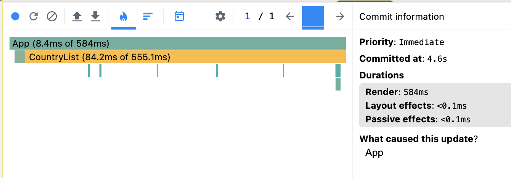
- **Screenshot**: 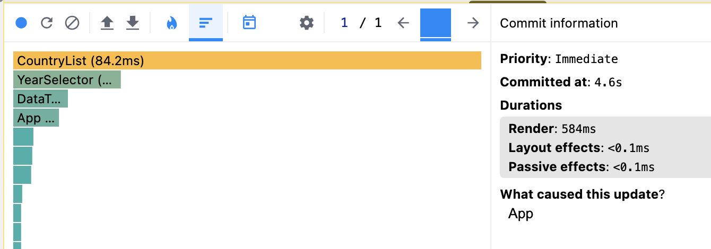

**Component:** `CountryList`
- **Render duration**: 84.2 ms
- **Why did this render:** props changed (sortField, onYearChange)

### Interaction B: Search countries

- **Commit duration**: 271.3 ms
- **Render duration**: 270.9 ms
- **Screenshot**: 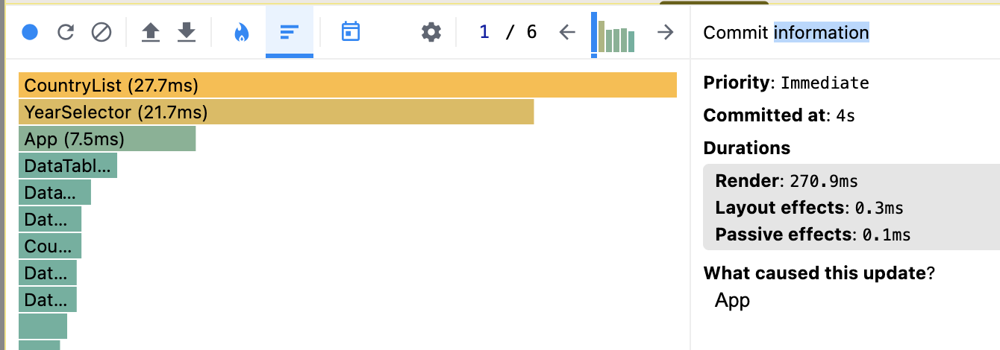
- **Screenshot**: 

**Component:** `CountryList`
- **Render duration**: 27.7 ms
- **Why did this render:** props changed (searchQuery, onYearChange)

**Component:** `YearSelector`
- **Render duration**: 21.7 ms
- **Why did this render:** props changed (years, onChange)

### Interaction C: Change year

- **Commit duration**: 675,2 ms
- **Render duration**: 675 ms
- **Screenshot**: 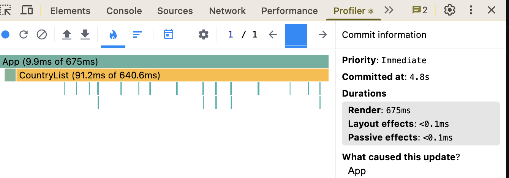
- **Screenshot**: 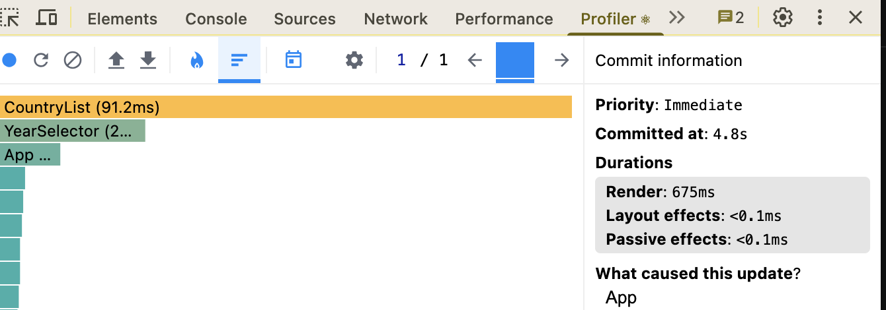

- **Component:** `CountryList` 
- **Render duration**: 91.2 ms
- **Why did this render:** props changed (selectedYear, onYearChange)

### Interaction D: Toggle column

- **Commit duration**: 627,1
- **Render duration**: 626.9 ms
- **Screenshot**: 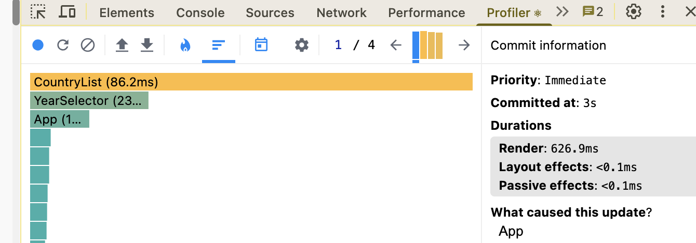
- **Screenshot**: 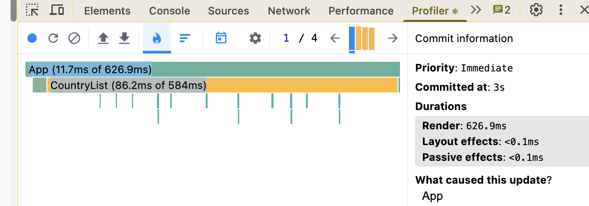

- **Component:** `CountryList` 
- **Render duration**: 86.2 ms
- **Why did this render:** props changed (years, onChange)

## Optimized Measurements

### Interaction A: Sort countries

- **Commit duration**: 28.2 ms
- **Render duration**: 28 ms
- **Screenshot**: 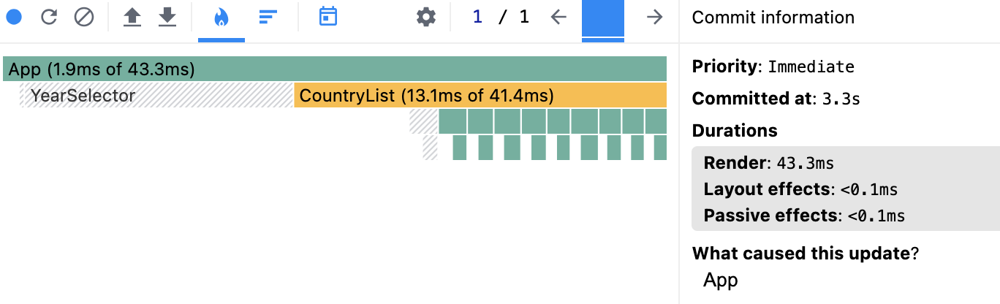
- **Screenshot**: 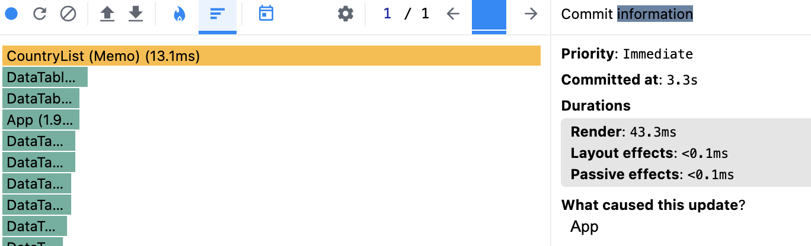

**Component:** `CountryList`
- **Render duration**: 10.9 ms
- **Why did this render:** props changed (sortField)

### Interaction B: Search countries

- **Commit duration**: 3 ms
- **Render duration**: 2.5 ms
- **Screenshot**: 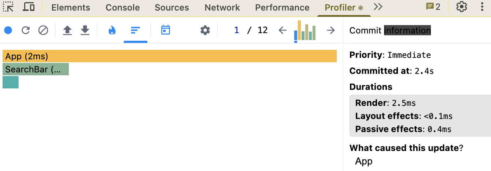
- **Screenshot**: 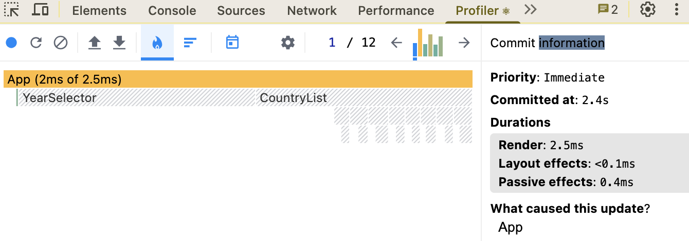

**Component:** `CountryList`
- **Did not client render**

**Component:** `YearSelector`
- **Did not client render**

### Interaction C: Change year

- **Commit duration**: 63.6 ms
- **Render duration**: 63.4 ms
- **Screenshot**: 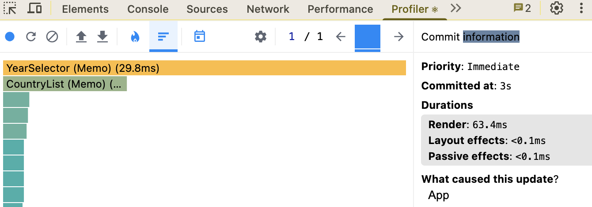
- **Screenshot**: 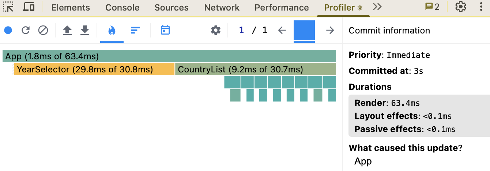

- **Component:** `CountryList` 
- **Render duration**: 9.2 ms
- **Why did this render:** props changed (selectedYear)

### Interaction D: Toggle column

- **Commit duration**: 9.1 ms
- **Render duration**: 8.9 ms
- **Screenshot**: 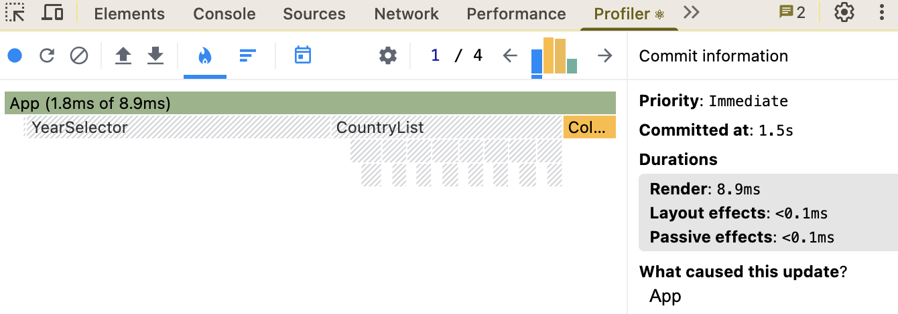
- **Screenshot**: 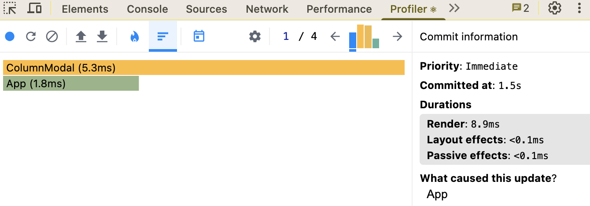

- **Component:** `CountryList` 
- **Did not client render**

## Summary of Improvements

| Interaction      | Baseline (ms) | Optimized (ms) | Improvement |
| ---------------- | ------------- | -------------- | ----------- |
| Sort countries   | 584.2         | 28.2           | 95.2%       |
| Search countries | 271.3         | 3.0            | 98.9%       |
| Change year      | 675.2         | 63.6           | 90.6%       |
| Toggle column    | 627.1         | 9.1            | 98.5%       |
| **Average**      | **539.5**    | **26.0**        | **95.2%%**  |